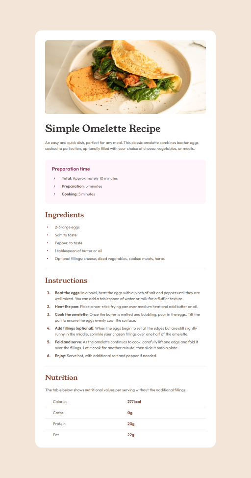

# Recipe Page

A solution to the Frontend Mentor recipe page challenge built using React and Sass,and set up using npm and Webpack.

## Table of Contents

- [Why I Built This Project](#why-i-built-this-project)
- [Preview](#preview)
- [Author](#author)

## Why I Built This Project

I built this project as part of a personal challenge to build more projects with React in order to become more comfortable with the library as it is one that's widely used in the tech industry.

I also wanted to gain more experience with HTML tables and lists as I haven't had much opportunity to use them prior to this challenge. It was interesting learning these new topics, and I'm looking forward to utilising them more in the future.

## Preview

## Author

- [My website](https://venusy.github.io/portfolio/)
- [Frontend Mentor](https://www.frontendmentor.io/profile/VenusY)
- [GitHub](https://github.com/VenusY)